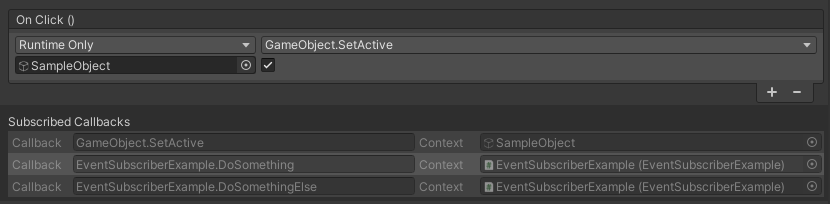
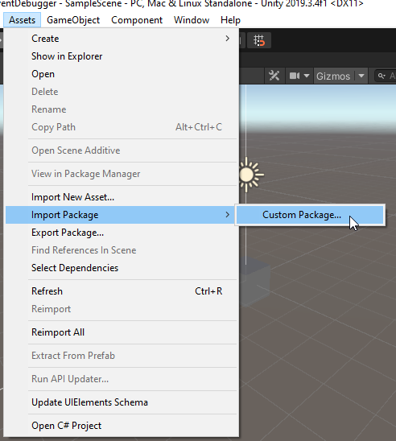
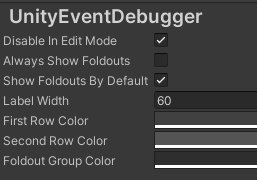

# UnityEventDebugger

Easily inspect callbacks on UnityEvents with _**UnityEventDebugger**_, a reflection-based solution to see which methods will be called upon invoking a UnityEvent.

## Installation 

I don't think there will be many changes in the future, but if there are, they will first be tested on the master branch and then being released properly once I'm sure it still works fine. This being said, the latest stable release of this tool will always be available on the latest release branch of this repository but you can also just use the master-branch.

### Unity Package Manager

Coming soon!

### Unity-Package

Inside of the unity project there is a folder called _**Packages**_. It will contain the newest release version as a .unitypackage. Download it and import it from within the editor:

Simply navigate to the packages file location on your pc inside of the resulting pop-up and select everything.

### Cloning the repository

You can also just download/clone the repository and import the files into your project manually. To do so, just drag and drop the _**UnityEventDebugger**_ folder into your project.

## Features & Usage

### Built-In UnityEvent-PropertyDrawer

The UnityEventDebugger comes with a built-in property drawer to inspect UnityEvents. The property drawer simply inherits the normal property drawer and draws any additional information onto the inspector. The enhanced drawer looks exactly like the one you see in the screenshot at the top!

### Easily extendible

You can build whatever tool you want off this. The information about which callbacks a specific event invokes can be retrieved by calling `UnityEventHelper.GetCallbacksOnObjectForEvent(Object theObject, string eventName)` inside your own code. 
It returns a list of `UnityEventMethodContextHolder`, a class that maps an event name to a method call and its context object. It supports three public properties:

* _**Context**_ - The UnityEngine.Object on which the callback method will be called.
* _**CallbackName**_ - A string formatted like `ClassName.MethodName`, indicating which method will be called upon invoking the event.
* _**EventName**_ - The member variable name of the event being invoked. E.g. Unitys Button onClick-Event will be named *m_onClick*.

You can use these in your tools to display the information wherever and however you want.

### UnityEventDebugger Preferences window

You can configure a bunch of settings in the Unity Preferences window. Just go to Edit -> Preferences -> UnityEventDebugger and you will see the following settings window:

* _**Disable In Edit Mode**_ - With this setting enabled, you will not see the foldout when outside of play mode. Since most UnityEvents happen only within play mode, this is enabled by default.
* _**Always Show Foldouts**_ - If this is enabled, all foldouts will always be expanded and you can not collapse them.
* _**Show Foldouts By Default**_ - This expands the foldouts when inspecting an element with a serialized UnityEvent, however you can collapse and expand it as you wish.
* _**Label Width**_ - The width used for the text labels in the inspector. Will only manipulate the UnityEventPropertyDrawer
* _**First Row Color**_ - Elements inside the foldouts are being drawin in alternating colors. This is the first one.
* _**Second Row Color**_ - Elements inside the foldouts are being drawin in alternating colors. This is the second one.
* _**Foldout Group Color**_ - Background color of the foldout group itself.

## How does it work under the hood?

It is quite simple:

I've made a small helper method `UnityEventHelper.GetCallbacksOnObjectForEvent(Object theObject, string eventName)` that does the magic.
Inside of it, I use reflection to find the member variable of the UnityEvent. Every UnityEvent internally uses a variation of BaseInvokableCall with its respective generic arguments, e.g. UnityEvent<T0> has a List of InvokableCall<T0>. There is quite a bunch of different implementations from UnityEventBase and BaseInvokableCall, but luckily the naming is consistent and every class deriving from BaseInvokableCall uses a UnityAction named *Delegate*. 
This name is being used to find exactly that UnityAction. There is one corresponding UnityAction for each existing InvokableCall variation and each UnityAction simply is a C# delegate. From there on you can simply use `delegate.GetInvocationList()` to retrieve all methods that will be invoked and their context object. 

Thats it!
